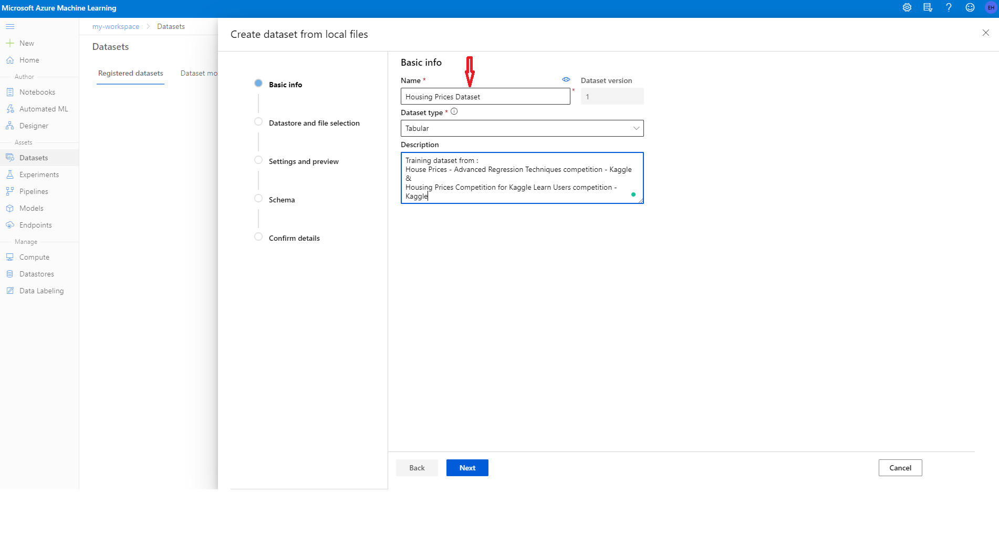

# Housing Prices

##### Table of Contents 

- [Overview](#overviews) 
- [Project Set-Up and Installation](#setup)
- [Dataset](#dataset)
    - [Overview](#overview)
    - [Task](#task)
    - [Access](#access)
- [Automated ML](#automl)
    - [AutoML Configuration](#automlc)
    - [Results](#aresults)
- [Hyperparameter Tuning](#hypert)
    - [Hyperdrive Configuration](#hyperc)
    - [Results](#hresults)
- [Model Deployment](#deploy)
- [Future Improvements](#improvements)
- [Screen Recording](#record)
- [References](#references)

## Overview <a name="overviews"/>

This is a Capstone Project for *[Azure Machine Learning Engineer Nanodegree Program - Udacity](https://www.udacity.com/course/machine-learning-engineer-for-microsoft-azure-nanodegree--nd00333)*.

In this project, we will create two models using a selected dataset: one using Automated ML and one customized model whose hyperparameters are tuned using HyperDrive. We will then compare the performance of both the models and deploy the best-performing model.

Housing prices datasets are perfect matches for starting Machine Learning (ML). They can easily be used to learn tabular data, missing values, imputations, encodings, fit and transform mechanisms, feature engineering, etc. As a result, lots of entry-level books and courses about ML use housing prices datasets in their contents.

Consequently, for this capstone project, I have decided to select a housing prices dataset from [Kaggle](https://www.kaggle.com/). There can be found lots of housing prices datasets in Kaggle. But, if some suitable competitions can be found, I can also participate in the competitions with the results of this project. As a result, I have decided to participate in two competitions: *[Housing Prices Competition for Kaggle Learn Users](https://www.kaggle.com/c/home-data-for-ml-course/overview) and [House Prices - Advanced Regression Techniques](https://www.kaggle.com/c/house-prices-advanced-regression-techniques)*. More details about these competitions and the related datasets will be given in the Dataset section.

My workflow will be as follows:

- Get the datasets,
- Import the datasets to AzureML Studio,
- Create an auto ml experiment and select the best auto ml run,
- Create a hyperdrive experiment and select the best hyperdrive run,
- Compare the runs and select the best run for the project,
- Save and register the best model,
- Create a submission file from the best model,
- Deploy a web service from the bestmodel
- Test the model endpoint.

<p style="color:blue;font-size:10px;">Workflow of the project</p>


## Project Set-Up and Installation <a name="setup"/>

- Click the green 'Code' button to download the .zip of the files from the GitHub repository,
- Unzip the starter_files folder,
- Access the Azure Machine Learning Workspace. If you don't have an Azure account you can create a free account by clicking the green *Try Azure for free* button in [this link](https://azure.microsoft.com/en-us/). **Beware! you may be charged to complete this project depending on your subscription**.
- Navigate to the *Datasets* page.
- Register the training dataset by clicking on *Create Dataset* button and select *From Local Files* option.

<p style="color:blue;font-size:10px;">Create dataset from local files</p>


- Name the dataset as *'Housing Prices Dataset'*, select *tabular* as the *dataset type* and click next.
<p style="color:blue;font-size:10px;">Naming the Dataset</p>



- Browse to the *'./starter_file/data'* folder in your computer and select *train.csv*, click next.

<p style="color:blue;font-size:10px;">Selecting the local file (train.csv)</p>


- Select *Use headers from the first file* option in the *Column headers* field.

<p style="color:blue;font-size:10px;">Changing column headers</p>


- Find the *GarageYrBlt* feature and change the *Type* field from *String* to *Integer* and click next.

<p style="color:blue;font-size:10px;">Changing Type of 'GarageYrBlt' column</p>


- Confirm the details and click the blue *Create* button.

<p style="color:blue;font-size:10px;">Create the training dataset</p>


- Follow the same steps and register the test dataset. To do this repeat the previous steps as described below. Beware of the name changes marked as bold!:
    - Click on the *Create Dataset* button and select the *From Local Files* option.
    - Name the dataset as **'Housing Prices Test Dataset'**.
    - Browse to the *'./starter_file/data'* folder in your computer and select **test.csv**.
    - Select *Use headers from the first file* option in the *Column headers*.
    - Find the *GarageYrBlt* feature and change the *Type* field from *String* to *Integer*.
    - Confirm the details and click the blue *Create* button.
- Navigate to Compute page.
- Create a new compute instance by clicking the new button.
- Select virtual machine size as *'Standard_DS3_v2'*. Leave everything as default and click next,
- Give a name to your compute instance and click the *Create* button.
- Navigate to the Notebooks page.
- From the left of the screen create a new folder by clicking the 3 dots next to your user name. Give the name *data* to the folder. 

<p style="color:blue;font-size:10px;">Create data folder</p>


- From the left of the screen select *Upload files* by clicking the 3 dots next to the data folder. Navigate to the *'./starter_file/data'* folder in your local computer and upload *train.csv, test.csv, sample_submission.csv* and *data_description.txt*  files by selecting them so that they can be used if needed. 

<p style="color:blue;font-size:10px;">Upload files to data folder</p>


- From the left of the screen select *Upload files* by clicking the 3 dots next to your user name. Navigate to the *'./starter_file'* folder in your local computer and upload *automl.ipynb, hyperparameter_tuning.ipynb, my-env.yml, score.py* and *train.py* files by selecting them.

<p style="color:blue;font-size:10px;">Upload files</p>


- Click on the *automl.ipynb and hyperparameter_tuning.ipynb* so that they can be opened on the editor.

- Run the notebooks by starting from the first cell one by one. 

## Dataset <a name="dataset"/>

### Overview <a name="overview"/>
I will be using the *[Ames Housing dataset](http://jse.amstat.org/v19n3/decock.pdf)* in this project. The original dataset was first published by Dean De Cock in his paper *[Ames, Iowa: Alternative to the Boston Housing Data as an End of Semester Regression Project](https://www.researchgate.net/publication/267976209_Ames_Iowa_Alternative_to_the_Boston_Housing_Data_as_an_End_of_Semester_Regression_Project) at Journal of Statistics Education (November 2011)*.

The original dataset is used in two different *[Kaggle](https://www.kaggle.com/)* competitions. The first competition is the *[Housing Prices Competition for Kaggle Learn Users](https://www.kaggle.com/c/home-data-for-ml-course/overview)*, and the second competition is the *[House Prices - Advanced Regression Techniques](https://www.kaggle.com/c/house-prices-advanced-regression-techniques)* competition.

These are regression competitions in which competitors try to predict the price of the houses in the **test dataset** using the **training dataset**.

The **training dataset** has 1460 rows and 81 columns (including the *Id* field and the target column *SalePrice*). The **test dataset**, on the other hand, has 1459 rows and 80 columns (excluding the target column *SalePrice*).

79 explanatory variables are describing (almost) every aspect of residential homes in Ames, Iowa.

For competition purposes, approximately all of the data has been divided into two parts: **training dataset** and **test dataset**. We will be using the **training dataset** for training and the **test dataset** for submission to the competition. We will also send requests to our deployed web service using the test dataset.

### Task <a name="task"/>
As written above this is a regression task. We will try to predict the final price of each home in the test set.

I will not explain all the dataset features since they are too many and beyond the scope of this project. However, the explanations can be found in the *[data_description.txt](https://github.com/ErkanHatipoglu/nd00333-capstone/tree/master/starter_file/data/data_description.txt)* file.

I will not use the 'Id' and 'Utilities' features. The former is just the id of the houses and the latter is the same for all items but one.

The target column is *SalePrice*. As mentioned above, this is a regression task project to predict house prices for a given set of features.

There are some missing values in the training and test datasets that are being handled by the clean_data functions. There are two clean_data functions. One is in the *automl.ipynb* and the other is in the *train.py* files. These functions are similar with some minor differences. The clean_data function in the *automl.ipynb* file, for example, transforms the test set, so that we can use it later to predict the house prices and submit to the competitions. I use sklearn transformers and pipelines to preprocess the data in the clean_data functions. 

### Access <a name="access"/>
The datasets can be downloaded from Kaggle. To download the necessary files just click on one of the competition links above and select the data tab. You may be required to get a free membership and accept the competition rules.

I have already downloaded the datasets to the data folder. Also, I have downloaded the *sample_submission.csv* and *data_description.txt* files. The *sample_submission.csv* file can be used to create submission files, while the *data_description.txt* file may be handy for data analysis.

I have registered the datasets using ML Studio's *Create dataset from local files* feature. The **training dataset** is registered as *Housing Prices Dataset* and the **test dataset** is registered as *Housing Prices Test Dataset*.

<p style="color:blue;font-size:10px;">Registered Datasets</p>


I have loaded these registered datasets as TabularDataset and converted them to pandas dataframes. 

**Warning: *GarageYrBlt* feature should be changed from *String* to *Integer* while creating both datasets. Otherwise, the clean_data function will crash! Kindly refer to *Project Set-Up and Installation* for details**.

## Automated ML <a name="automl"/>
I need to emphasize an important issue first. As I have stated earlier, I have used sklearn transformers and pipelines to preprocess the data in the clean_data functions. Because of those transformations, the column names of the resultant dataframes are being removed. However, my automl configuration needs the target column name. As a result, I have added numeric column names to the resultant dataframes in the notebook. Nothing to be done while reproducing. 

A second issue is the number of columns. Because of the indeterministic nature of my clean_data functions (there is no random_state parameter in the *train_test_split* function), the number of the columns will differ for every run of the notebook if the kernel is restarted. As a result, anyone reproducing the code will probably see different column numbers than this notebook in the repository. But this will not cause any error except for one cell. This cell is only for demonstration purposes and does not affect the automl run. On the other hand, while reproducing, if you want to run all the cells (by clicking the double arrows as shown in the figure below) you need to delete this cell. The cell is shown below:

<p style="color:blue;font-size:10px;">Delete this cell if needed!</p>


### AutoML Configuration <a name="automlc"/>

As described in [Configure automated ML experiments in Python](https://docs.microsoft.com/en-us/azure/machine-learning/how-to-configure-auto-train), there are several options that we can use to configure our automated machine learning experiment. These parameters are set by instantiating an AutoMLConfig object. Below can be found the descriptions and the reasoning for some important parameters:

- *experiment_timeout_minutes*: Maximum amount of time in minutes that all iterations combined can take before the experiment terminates. **We do not want our experiment to cost too much.**

- *max_concurrent_iterations*: Represents the maximum number of iterations that would be executed in parallel. **Since we have *4* nodes in our AmlCompute cluster I have selected 4.**

- *max_cores_per_iteration*: The maximum number of threads to use for a given training iteration. **I have selected *-1* to use all the possible cores per iteration per child-run.** 

- *training_data*: The training data to be used within the experiment (including the target column).

- *validation_data*: The validation data to be used within the experiment (including the target column).

- *label_column_name*: The name of the target column.  

- *enable_early_stopping*: Whether to enable early termination if the score is not improving in the short term. **We do not want our experiment to cost too much.**

- *task*: The type of task to run. For our case, it is **regression**.

- *primary_metric*: The metric that Automated Machine Learning will optimize for model selection. I have chosen *normalized_root_mean_squared_error* as suggested in [this article](https://docs.microsoft.com/en-us/azure/machine-learning/how-to-configure-auto-train#primary-metric).

### Results <a name="aresults"/>

The best model for the AutoML run is a *VotingEnsemble* by the given metrics below.

- *normalized_root_mean_squared_error:* 0.029610347347248284
- *root_mean_squared_log_error:* 0.11724443714762385
- *mean_absolute_error:* 14028.03885241191

The model is as follows:

```
datatransformer
{'enable_dnn': None,
 'enable_feature_sweeping': None,
 'feature_sweeping_config': None,
 'feature_sweeping_timeout': None,
 'featurization_config': None,
 'force_text_dnn': None,
 'is_cross_validation': None,
 'is_onnx_compatible': None,
 'logger': None,
 'observer': None,
 'task': None,
 'working_dir': None}

prefittedsoftvotingregressor
{'estimators': [('1',
                 Pipeline(memory=None,
         steps=[('maxabsscaler', MaxAbsScaler(copy=True)),
                ('xgboostregressor',
                 XGBoostRegressor(base_score=0.5, booster='gbtree',
                                  colsample_bylevel=1, colsample_bynode=1,
                                  colsample_bytree=1, gamma=0,
                                  importance_type='gain', learning_rate=0.1,
                                  max_delta_step=0, max_depth=3,
                                  min_child_weight=1, missing=nan,
                                  n_estimators=100, n_jobs=-1, nthread=None,
                                  objective='reg:squarederror', random_state=0,
                                  reg_alpha=0, reg_lambda=1, scale_pos_weight=1,
                                  seed=None, silent=None, subsample=1,
                                  tree_method='auto', verbose=-10,
                                  verbosity=0))],
         verbose=False)),
                ('26',
                 Pipeline(memory=None,
         steps=[('maxabsscaler', MaxAbsScaler(copy=True)),
                ('gradientboostingregressor',
                 GradientBoostingRegressor(alpha=0.9, ccp_alpha=0.0,
                                           criterion='friedman_mse', init=None,
                                           learning_rate=0.046415888336127774,
                                           loss='ls', max_depth=8,
                                           max_features=0.05,
                                           max_leaf_nodes=None,
                                           min_impurity_decrease=0.0,
                                           min_impurity_split=None,
                                           min_samples_leaf=0.01091729022778783,
                                           min_samples_split=0.03708777411774474,
                                           min_weight_fraction_leaf=0.0,
                                           n_estimators=200,
                                           n_iter_no_change=None,
                                           presort='deprecated',
                                           random_state=None, subsample=0.25,
                                           tol=0.0001, validation_fraction=0.1,
                                           verbose=0, warm_start=False))],
         verbose=False)),
                ('32',
                 Pipeline(memory=None,
         steps=[('standardscalerwrapper',
                 <azureml.automl.runtime.shared.model_wrappers.StandardScalerWrapper object at 0x7fbac35b9dd8>),
                ('gradientboostingregressor',
                 GradientBoostingRegressor(alpha=0.9, ccp_alpha=0.0,
                                           criterion='friedman_mse', init=None,
                                           learning_rate=0.1, loss='ls',
                                           max_depth=6, max_features=0.3,
                                           max_leaf_nodes=None,
                                           min_impurity_decrease=0.0,
                                           min_impurity_split=None,
                                           min_samples_leaf=0.0416307426011415,
                                           min_samples_split=0.04427451843494491,
                                           min_weight_fraction_leaf=0.0,
                                           n_estimators=100,
                                           n_iter_no_change=None,
                                           presort='deprecated',
                                           random_state=None,
                                           subsample=0.44999999999999996,
                                           tol=0.0001, validation_fraction=0.1,
                                           verbose=0, warm_start=False))],
         verbose=False)),
                ('30',
                 Pipeline(memory=None,
         steps=[('pca',
                 PCA(copy=True, iterated_power='auto',
                     n_components=0.5047368421052632, random_state=None,
                     svd_solver='auto', tol=0.0, whiten=False)),
                ('xgboostregressor',
                 XGBoostRegressor(base_score=0.5, booster='gbtree',
                                  colsample_bylevel=1, colsample_bynode=1,
                                  colsample_bytree=1, eta=0.4, gamma=0,
                                  importance_type='gain', learning_rate=0.1,
                                  max_delta_step=0, max_depth=6, max_leaves=7,
                                  min_child_weight=1, missing=nan,
                                  n_estimators=600, n_jobs=-1, nthread=None,
                                  objective='reg:squarederror', random_state=0,
                                  reg_alpha=0.7291666666666667,
                                  reg_lambda=0.3125, scale_pos_weight=1,
                                  seed=None, silent=None, subsample=0.8,
                                  tree_method='auto', verbose=-10,
                                  verbosity=0))],
         verbose=False)),
                ('8',
                 Pipeline(memory=None,
         steps=[('minmaxscaler', MinMaxScaler(copy=True, feature_range=(0, 1))),
                ('elasticnet',
                 ElasticNet(alpha=0.001, copy_X=True, fit_intercept=True,
                            l1_ratio=0.32263157894736844, max_iter=1000,
                            normalize=False, positive=False, precompute=False,
                            random_state=None, selection='cyclic', tol=0.0001,
                            warm_start=False))],
         verbose=False)),
                ('19',
                 Pipeline(memory=None,
         steps=[('standardscalerwrapper',
                 <azureml.automl.runtime.shared.model_wrappers.StandardScalerWrapper object at 0x7fbac35d4cf8>),
                ('decisiontreeregressor',
                 DecisionTreeRegressor(ccp_alpha=0.0, criterion='friedman_mse',
                                       max_depth=None, max_features=None,
                                       max_leaf_nodes=None,
                                       min_impurity_decrease=0.0,
                                       min_impurity_split=None,
                                       min_samples_leaf=0.01877954764413522,
                                       min_samples_split=0.03708777411774474,
                                       min_weight_fraction_leaf=0.0,
                                       presort='deprecated', random_state=None,
                                       splitter='best'))],
         verbose=False))],
 'weights': [0.2, 0.2, 0.1, 0.2, 0.2, 0.1]}
```

As can be seen, the model is voting regressor which is composed of 6 prefitted estimators:

- XGBoostRegressor (weight=0.2) with a maxabsscaler pre-transformation,
- GradientBoostingRegressor (weight=0.2) with a maxabsscaler pre-transformation,
- GradientBoostingRegressor (weight=0.1) with a standardscaler pre-transformation,
- XGBoostRegressor (weight=0.2) with a PCA pre-transformation,
- ElasticNet (weight=0.2) with a minmaxscaler pre-transformation,
- DecisionTreeRegressor (weight=0.1) with a standardscaler pre-transformation.

We can find the best model in different ways after the experiment finishes.

- By exploring the *RunDetails* widget using the notebook,

<p style="color:blue;font-size:10px;">RunDetails widget</p>


   
   If we edit the *automl.ipynb* in a jupyter notebook (by using the *Editors* feature of Azure ML Studio) we can see a more comprehensive *RunDetails* widget.
   
<p style="color:blue;font-size:10px;">Editors Feature of Azure ML Studio</p>

   

<p style="color:blue;font-size:10px;">RunDetails widget (Jupyter Notebook) - View 1</p>


<p style="color:blue;font-size:10px;">RunDetails widget (Jupyter Notebook) - View 2</p>

  

<p style="color:blue;font-size:10px;">RunDetails widget (Jupyter Notebook) - View 3</p>

  

- By writing code using the notebook,

<p style="color:blue;font-size:10px;">Displaying best model proporties using the notebook</p>


- By exploring the *Experiments* tab using the Azure ML Studio,

<p style="color:blue;font-size:10px;">Completed experiment with the best model summary</p>


The models of the experiment may furtherly be explored by clicking the models tab.

<p style="color:blue;font-size:10px;">AutoML models</p>


We can also click on the best-performing model and explore the details of that model.

<p style="color:blue;font-size:10px;">Best performing AutoML model</p>


We can explore the model explanation and the metrics we are interested in. Other than the primary metric, we are interested in the mean absolute error and the root mean squared log error since these are the metrics used in the competitions given above.

<p style="color:blue;font-size:10px;">Model explanation</p>


<p style="color:blue;font-size:10px;">Metrics</p>


The metrics of the best-performing model can also be explored in the related run's view.

<p style="color:blue;font-size:10px;">Best performing AutoML model with Metrics</p>


We can run new AutoML experiments to improve our model. Because of the indeterministic nature of our model with every new run, we get different results.

We can also make some feature engineering before the preprocessing step or after exploring the feature importance tab.

<p style="color:blue;font-size:10px;">Feature importance for the best model</p>


Since we already know the estimator for the best performing model (kindly refer to automl.ipynb for more details), we can try to tune the model, add new models to the voting regressor or retrain the model without validation set (this may reduce the chance of overfitting).

<p style="color:blue;font-size:10px;">Estimator for the best performing model</p>


Since the automl model is better than the hyperdrive model, I have used it to create a submission file for the competitions. This file can be found in the data folder as *submission.csv*. My submissions and the results are as follows:

<p style="color:blue;font-size:10px;">Housing Prices Competition for Kaggle Learn Users - Submission</p>


<p style="color:blue;font-size:10px;">Housing Prices Competition for Kaggle Learn Users - Result</p>


<p style="color:blue;font-size:10px;">House Prices - Advanced Regression Techniques - Submission</p>


<p style="color:blue;font-size:10px;">House Prices - Advanced Regression Techniques - Result</p>


The results are as follows:

- MAE (Housing Prices Competition for Kaggle Learn Users): 14058.80470
- RMSLE (House Prices - Advanced Regression Techniques): 0.12774

The mean absolute error result is similar to the validation result (MAE: 14028.03885) but the root mean squared log result is much higher than the validation result (RMSLE: 0.11724). It seems that I am overfitting the data. I need to improve my model to reduce overfitting. Adding more data to the training set and/or making some feature engineering will probably improve the model.

## Hyperparameter Tuning <a name="hypert"/>
### Hyperdrive Configuration <a name="hyperc"/>

I have used [GradientBoostingRegressor](https://scikit-learn.org/stable/modules/generated/sklearn.ensemble.GradientBoostingRegressor.html) from [scikit-learn](https://scikit-learn.org/stable/index.html) library. This is a Gradient Boosting for regression. Despite the *[No free lunch theorem](https://en.wikipedia.org/wiki/No_free_lunch_theorem)*, from my previous experience, I believe that gradient boosting gives good results for this dataset. Detailed explanation for *Gradient Boosting* can be found in this [User Guide](https://scikit-learn.org/stable/modules/ensemble.html#gradient-boosting). Some important parameters for GradientBoostingRegressor are:

- learning_rate(float), default=0.1

   Learning rate shrinks the contribution of each tree by learning_rate. There is a trade-off between learning_rate and n_estimators.

- n_estimators (int), default=100

   The number of boosting stages to perform. Gradient boosting is fairly robust to over-fitting so a large number usually results in better performance.

In addition to their importance, these parameters can be used as an example for discrete hyperparameters (choice) and continuous hyperparameters (Uniform).

As can be seen in [Hyperparameter tuning a model with Azure Machine Learning](https://docs.microsoft.com/en-us/azure/machine-learning/how-to-tune-hyperparameters) we need to

- Define the parameter search space,
- Specify a primary metric to optimize,
- Specify early termination policy for low-performing runs,

Since the learning rate is type float, a continuous search space needs to be selected. uniform() returns a value uniformly distributed between low and high which is used for learning rate. The range for the search space (for the learning rate) is between *0.001* and *0.1*. *0.1* is the default value for the learning rate. As explained above there is a trade-off between the learning rate and the number of estimators. This means that we need to decrease the learning rate to increase the number of estimators. Since I want to increase the number of estimators (explained below), I made the default value to be the maximum of the search space (high) and tried to decrease the learning rate as much as possible by setting the low value to *0.001*.

Since the number of estimators is type int, a discrete search space needs to be selected. Discrete hyperparameters are specified as a choice() among discrete values. The range for the search space (for the number of estimators) is between *100* and *500*. *100* is the default value for the number of estimators. As explained above increasing the number of estimators may decrease overfitting. As a result, made the default value be the minimum of the search space (low) and tried to increase the number of estimators as much as possible by setting the high value to *500*.

Random sampling supports discrete and continuous hyperparameters. It supports the early termination of low-performance runs. As a result, it will be a good choice for parameter sampling.

For our AutoML experiment, the primary metric is chosen to be **normalized_root_mean_squared_error** as suggested in [this article](https://docs.microsoft.com/en-us/azure/machine-learning/how-to-configure-auto-train#primary-metric). Since we have to compare the two models for deployment the same primary metric must be chosen for hyperdrive run. Low values are better for this metric.

We can automatically terminate poorly performing runs with an early termination policy. Early termination improves computational efficiency. Bandit policy is based on slack factor/slack amount and evaluation interval. Bandit terminates runs where the primary metric is not within the specified slack factor/slack amount compared to the best performing run. We can select Bandit policy as an early termination policy for more aggressive savings.

Since the estimator class is deprecated and gives an error while calculating mean_squared_error, a ScriptRunConfig object has been used as suggested [here](https://docs.microsoft.com/en-us/python/api/azureml-train-core/azureml.train.estimator.estimator?view=azure-ml-py). Also an environment is created to remove the mean_squared_error calculation error.

max_concurrent_runs has been selected as *4* since the AmlCompute cluster has 4 nodes.

max_total_runs has been selected as *40* for more runs.

A training script is needed for training. *train.py* is used as a training script and can be found in the starter_files folder of the repository. Sklearn pipelines and transformers are used for preprocessing in the training script since there are missing values in the dataset.

### Results <a name="hresults"/>

The best model for the Hyperdrive run has the arguments below:

- learning rate: 0.0925131569584366
- number of estimators: 100

The best model for the Hyperdrive run has the metrics below:

- *normalized_root_mean_squared_error:* 0.032666490716132174
- *root_mean_squared_log_error:* 0.1279803797267253
- *mean_absolute_error:* 15671.028999405176

These metrics are worse than the AutoML model. As a result, I have used the AutoML model for deployment.

We can watch the status of the Hyperdrive run within the notebook.

<p style="color:blue;font-size:10px;">Execution Summary</p>


<p style="color:blue;font-size:10px;">RunDetails Widget</p>


<p style="color:blue;font-size:10px;">RunDetails Widget (Jupyter Notebook)</p>


<p style="color:blue;font-size:10px;">Best Model</p>


We can also watch the status of the Hyperdrive run by using the AzureML Studio.

<p style="color:blue;font-size:10px;">Run details</p>


<p style="color:blue;font-size:10px;">Child Runs</p>


<p style="color:blue;font-size:10px;">Best Model Details</p>


<p style="color:blue;font-size:10px;">Best Model Metrics</p>


<p style="color:blue;font-size:10px;">Hyperdrive Experiment</p>


<p style="color:blue;font-size:10px;">Registered Hyperdrive Model</p>


We can try new hyperdrive runs to improve the model. We already know that our model is overfitting the data (from the Kaggle competitions results). It seems that because of the random sampling we have a small number of estimators value for the best model. Since we are overfitting the data, a higher number of estimators value may decrease overfitting. As a result, rerunning the experiment and increasing the number of estimators search space will probably improve the model.

## Model Deployment <a name="deploy"/>

- *normalized_root_mean_squared_error*
    - *AutoML Model:* 0.029610347347248284
    - *Hyperdrive Model:* 0.032666490716132174
- *root_mean_squared_log_error*
    - *AutoML Model* 0.11724443714762385
    - *Hyperdrive Model:* 0.1279803797267253
- *mean_absolute_error*
    - *AutoML Model:* 14028.03885241191
    - *Hyperdrive Model:* 15671.028999405176

As can be seen, the AutoML model gives better results. As a result, I have deployed the AutoML model as a web service.

I have registered the best AutoML run for feature uses.

<p style="color:blue;font-size:10px;">Registered AutoML Model</p>


We need an environment to deploy the models. We can both define a custom environment or use an Azure curated environment.

I have first created an Azure curated AutoML environment. Then by using the dependencies of this environment I have generated a *.yml* file. By using this *.yml* file I have created a second environment that I used for deployment. By doing this I have both showed to create a custom environment or use an Azure curated environment. Besides, I have fulfilled the project requirements.

We also need a scoring script (entry) for deployment. This script (score.py) can be found in the starter_files folder of the repository. In this script an init() function that loads the model and a run() function that predicts the requested query must be defined. The input to the run() function is a JSON string.

Finally, we need to define a deployment configuration.

<p style="color:blue;font-size:10px;">Model Deployment Code</p>


<p style="color:blue;font-size:10px;">Model Endpoint - Transitioning State</p>


<p style="color:blue;font-size:10px;">Model Endpoint - Healthy State</p>


<p style="color:blue;font-size:10px;">Endpoints tab</p>


<p style="color:blue;font-size:10px;">Application insights link</p>


To get a [JSON 200](http://enocean-gateway.eu/images/documents/Documentation/error-codes.html) answer (returned when an application request is successful) from the web service we need to create a JSON string. This string needs to be a dictionary with a key *'data'*. The value of this key is a list of dictionaries. Each inner dictionary has keys of column names and values corresponding to the related item that is being queried. An example JSON String for one item (house) can be found in the *data.json* file.

As described above, this JSON string is only for the model (automl_model.pkl) which is in the *'./starter_file'* folder of the repository. For every new model (if the project is reproduced) the JSON string will be slightly different because of the varying column numbers. The related cells of the notebook **will handle this automatically**. 

The code that handles JSON string for one item is as follows:

```
# Request for 1 item
# Get the test data
my_test_values = test_dataset.to_pandas_dataframe()
test_list = my_test_values.values.tolist()

# Get first item
my_list=test_list[0]

# Create JSON string
my_data={}
print("Length: ")
print(len(my_list))

# Create dictionary
for count in range(len(my_list)):
    my_data[str(count)]=my_list[count]
print("My Data: ")
print(my_data)

# Convert to JSON format

data = {"data":
        [
          my_data,
      ]
    }

print("Data: ")
print(data)

# Convert to JSON string
input_data = json.dumps(data)
print("Input data")
print(input_data)
```

The code that handles JSON string for 3 items is as follows:

```
# Request for 3 items
my_list_2 = my_test_values.values.tolist()
my_list=[my_list_2[0], my_list_2[1], my_list_2[2]]
test_list=[]
# Create JSON string
for item in my_list:
    # Create dictionary
    my_data={}
    for count in range(len(item)):
        my_data[str(count)]=item[count]
    test_list.append(my_data)
data = {"data":
        test_list
    }
# Convert to JSON string
input_data = json.dumps(data)
```

*test_dataset* is a tabular dataset that is created from *test.csv* within the notebook.

The response of the web service for the first item in the *test.csv* file is as follows:

<p style="color:blue;font-size:10px;">Response of the web service for one item</p>


I got this answer by sending a post request as follows:

```
# Set the content type
headers = {'Content-Type': 'application/json'}

# Make the request and display the response
resp = requests.post(service.scoring_uri, input_data, headers=headers)

print(resp.text)
```

The response of the web service for the first 3 item in the *test.csv* file is as follows:

<p style="color:blue;font-size:10px;">Response of the web service for three items</p>


I got this answer by the run method of the service object:

```
# Send the request
output = service.run(input_data)

print(output)
```

These values can also be compared to the first 3 items in the *submission.csv* file that is predicted by the model above.

## Future Improvements <a name="improvements"/>

As can be seen from the results it is obvious that the model is overfitting the data. As a result, we can either increase the training data or decrease the number of features. 

To increase the training data:

- We can use the model (Voting Regressor described above) and retrain it with the full training data. After that, we can update our service with the new model.

To decrease the number of features:

- We can apply feature engineering to our raw training data in the clean_data function and run new AutoML and Hyperdrive experiments, get the best model, and update our service with the new model. Or,
- Explore the feature importance tab, select the most important *n* features, and run new AutoML and Hyperdrive experiments with those features, get the best model and update our service with the new model. 

We can also try new AutoML and Hyperdrive experiments (without changing anything) hoping to get a better model. But I don't think that this will increase our model performance as much as required.

Besides the model,

- We can try [scaling](https://docs.microsoft.com/en-us/azure/machine-learning/classic/create-endpoint#scaling) our web service by adding additional endpoints for learning purposes,
- We can [automatically generate a Swagger schema](https://docs.microsoft.com/en-us/azure/machine-learning/how-to-deploy-advanced-entry-script#automatically-generate-a-swagger-schema) using the score.py file by adding *input_schema* and *output_schema*,
- We can [profile](https://docs.microsoft.com/en-us/azure/machine-learning/how-to-deploy-profile-model?pivots=py-sdk) the model to determine resource utilization,
- We [create a client](https://docs.microsoft.com/en-us/azure/machine-learning/how-to-consume-web-service?tabs=python) for the web service.

## Screen Recording <a name="record"/>
[Project Screencast](https://www.youtube.com/watch?v=vO6-I2WSCMA)

## References <a name="references"/>
- [Azure-Machine Learning Notebooks](https://github.com/Azure/MachineLearningNotebooks)
- [Azure Machine Learning documentation](https://docs.microsoft.com/en-us/azure/machine-learning/)
- [Machine Learning Engineer for Microsoft Azure Course Content](https://www.udacity.com/course/machine-learning-engineer-for-microsoft-azure-nanodegree--nd00333)
- [nd00333_AZMLND_Optimizing_a_Pipeline_in_Azure-Starter_Files](https://github.com/ErkanHatipoglu/nd00333_AZMLND_Optimizing_a_Pipeline_in_Azure-Starter_Files)
- [nd00333_AZMLND_C2](https://github.com/ErkanHatipoglu/nd00333_AZMLND_C2)
- [Creating table of contents](https://stackoverflow.com/questions/18244417/how-do-i-create-some-kind-of-table-of-content-in-github-wiki)
- [Markdown Cheatsheet](https://github.com/adam-p/markdown-here/wiki/Markdown-Cheatsheet)

Thank you for reading.